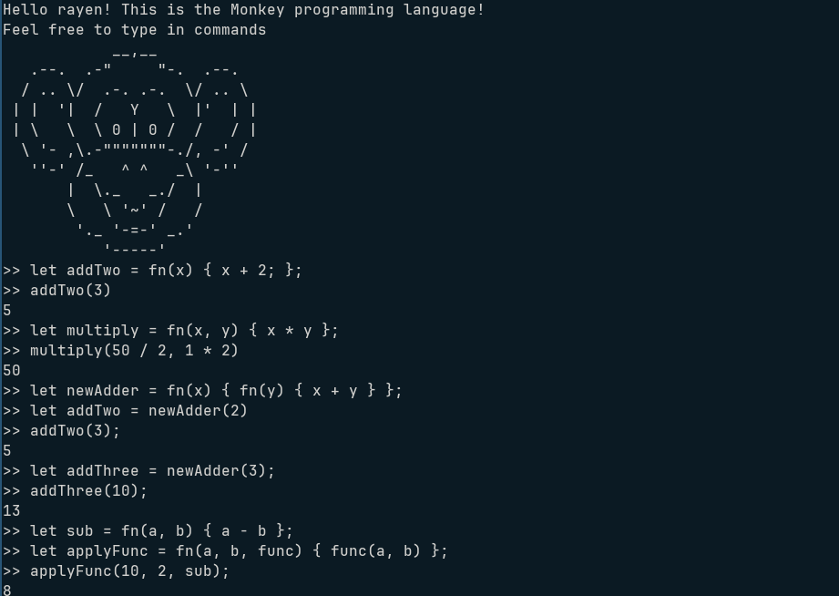

# Writing an Interpreter in Go

This repository contains the implementation of an interpreter following the book "Writing an Interpreter in Go" by Thorsten Ball. 
The book walks through building a lexer, parser, and an evaluator for a simple programming language from scratch using Go.

## 📚 Reference
**Book:** [Writing an Interpreter in Go](https://interpreterbook.com/) by Thorsten Ball. 
A top tier book I would absolutetly recommend.

## 🚀 How to Run

Make sure you have Go installed.

1. Clone the Repository
```bash

git clone https://github.com/RayenManai/interpreter_in_go.git
cd interpreter_in_go

```
2. Run the REPL (Read-Eval-Print Loop):
```bash

go run main.go

```


3. To run tests, use:

```bash

go test ./...

```

## ✨ Features Implemented

### Lexer (Tokenization)
- Reads input character by character and converts it into tokens

### Parser (Abstract Syntax Tree - AST)
- Converts the sequence of tokens into an AST representation.
- Implements recursive descent parsing ([Pratt Parsing](https://journal.stuffwithstuff.com/2011/03/19/pratt-parsers-expression-parsing-made-easy/))

### Tree-walking interpreter (Evaluator)

### REPL (Read-Eval-Print Loop): 
- wth is a REPL? simple, just execute python3 in your terminal and you get a repl :)

